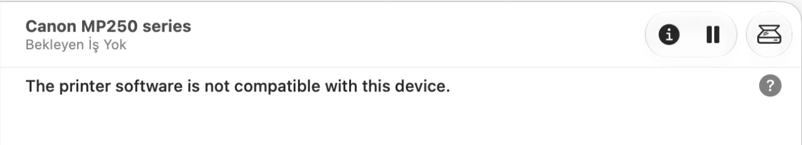

# Apple Silicon Printer Drivers

**Your printer stopped working after a macOS update? "The printer software is not compatible with this device"?**

Free fix for 3,500+ Canon, Epson, HP, Brother, Samsung, Lexmark and other printers on Apple Silicon Macs.
Website: **https://theshiver.github.io/apple-silicon-printer-drivers/**

## Fix it

1. Plug the printer into the Mac with USB and switch it on.
2. **[Download the installer](https://github.com/theshiver/apple-silicon-printer-drivers/releases/latest)** and open it. Click through, enter your password. (Signed and notarized by Apple, no warnings.)
3. Print.

That's it. The installer finds the printer and sets it up.

## Didn't work?

- **It still shows the old error / old printer entry:** restart the Mac once, then unplug and re-plug the printer.
- **The printer wasn't added:** check it's supported on the website, it tells you what to do: https://theshiver.github.io/apple-silicon-printer-drivers/#search
- **Wi-Fi / network printer:** see the FAQ below.
- **Something else:** [open an issue](https://github.com/theshiver/apple-silicon-printer-drivers/issues) with your printer model and macOS version.

---

## Supported printers

3,608 models. Search yours on the [website](https://theshiver.github.io/apple-silicon-printer-drivers/#search) or by brand:

Canon (PIXMA, BJC, SELPHY) · Epson (Stylus, Expression, WorkForce) · HP (DeskJet, LaserJet, OfficeJet) · Brother · Samsung · Lexmark · Xerox · Kyocera · Ricoh · Oki · Dell · Sharp · Kodak · DNP · Mitsubishi · Sony · Fujifilm · Citizen · Shinko · Olympus

Brother mono lasers without PCL or AirPrint (HL-1110, HL-1210W, HL-2270DW, HL-L2300D, DCP-7065DN, MFC-7360N and others) are covered by the bundled brlaser driver.

Not covered: scanners on all-in-ones, most modern laser MFPs, and anything macOS already sets up by itself via AirPrint (if it just works, you don't need this).

## FAQ

**Why did my printer stop working?**
The printer maker's driver was built for Intel Macs only. It ran on Apple Silicon through Rosetta until macOS 27, which no longer allows that. The maker never released an Apple Silicon version. This installer replaces it with a native driver.

**Still on macOS 26 or earlier?**
Your printer works now, but will break when you update if it uses one of those drivers. Install this before or after, either way.

**I had the old Canon driver. Why the restart?**
Canon's driver installs a small kernel extension that blocks macOS's own USB printer driver. The installer moves it aside (to `/Users/Shared/printer-driver-backup`, nothing is deleted) and macOS needs one restart to notice.

**My printer is on Wi-Fi, not USB.**
Install the package, then either add it in *System Settings → Printers & Scanners → Add → Use: Select Software…* and pick the entry ending in "Apple Silicon", or in Terminal:
`sudo gutenprint-add <model-id> MyPrinter socket://<printer-ip>` (model id from the website search; `lpinfo -v` lists addresses).

**Add a printer by hand (not detected on USB):**
`gutenprint-add --list "iP4300"` to find the id, then `sudo gutenprint-add bjc-PIXMA-iP4300`.

**Where are print quality and black & white?**
In the print dialog, open Printer Features (Printer Options on macOS 27). Quality is under Resolution, not Print Quality: Automatic, Draft, High, Photo modes and so on, depending on the printer. For black & white set Color Model to Grayscale. Presets offers Text and Photograph tuning.

**Black doesn't print, or colors look off.**
First run a nozzle check from the printer itself: an empty or clogged black cartridge is the usual cause, and this driver can't show ink levels like the maker's driver did. Then check in Printer Features that no “color-only” mode is selected under Resolution or Ink Set. Colors can look a little different from the maker's driver because the color tables are different.

**Does the scanner work?**
No, only printing. For scanning use VueScan or SANE.

**Is it safe?**
The installer is signed with an Apple Developer ID and notarized by Apple. Every step it takes is listed in [SECURITY.md](SECURITY.md); the install script is plain shell you can read. Releases are also built from source on GitHub Actions with a build attestation.

**Uninstall:** `sudo ./uninstall.sh`

## ☕ Buy me a coffee

This started as a weekend fix for one printer and grew into something a lot of people needed. If it saved you from buying a new printer, you can [sponsor me on GitHub](https://github.com/sponsors/theshiver). A coffee is plenty.

---

## Technical details

The package contains [Gutenprint 5.3.4](https://gimp-print.sourceforge.io/) (GPL-2.0), the open source driver suite that has supported these printers on Linux for 20 years, compiled natively for arm64 and installed under `/Library/Printers/Gutenprint`. Printing goes through Apple's own USB printer class driver, so nothing Intel-only is involved.

| Path | Purpose |
|---|---|
| `/Library/Printers/Gutenprint/libexec/rastertogutenprint.5.3` | arm64 CUPS raster filter (static Gutenprint, signed) |
| `/Library/Printers/Gutenprint/libexec/rastertobrlaser` | arm64 Brother laser raster filter (brlaser v6) |
| `/Library/Printers/Gutenprint/share/brlaser` | Brother PPDs, GPL license and exact brlaser source archive |
| `/Library/Printers/Gutenprint/libexec/commandtocanon`, `commandtoepson` | maintenance commands (head clean, nozzle check) |
| `/Library/Printers/Gutenprint/libexec/cups-genppd.5.3` | PPD generator |
| `/Library/Printers/Gutenprint/bin/gutenprint-add` (+ symlink in `/usr/local/bin`) | adds a printer by model id |
| `/Library/Printers/Gutenprint/share/gutenprint/5.3/xml` | printer / dither / paper definitions |
| `/Library/Printers/PPDs/Contents/Resources/Gutenprint-*.ppd` | PPDs generated on demand, with absolute filter paths |

The post-install script matches each `usb://Vendor/Model` device from `lpinfo -v` against the combined Gutenprint and brlaser model names (word match, brlaser before Gutenprint, then shortest name wins) and calls `gutenprint-add` for it.

Things that bit us on macOS 27, for anyone porting another driver:

- Apple's `cupsd` runs filters in a sandbox that can read `/Library/Printers` but **not** `/usr/local`, and `/usr/libexec/cups` is SIP-protected. Everything lives under `/Library/Printers/Gutenprint` and the PPD's `*cupsFilter` lines use absolute paths.
- Gutenprint needs `CFLAGS="-O2 -D_DARWIN_C_SOURCE"` or `netinet/ip.h` fails on `u_char`.
- Canon's IJ driver ships a codeless `AppleUSBMergeNub` kext (`/Library/Extensions/BJUSBLoad.kext`) that pins its x86_64 USB class-driver plugin to the printer in the I/O Registry. While it is loaded the `usb` backend won't fall back to Apple's generic class driver. Other vendors' leftovers: open an issue with `ls /Library/Extensions` output.
- macOS 27 marks any queue whose filters lack an arm64 slice as *Software Incompatible* on every `cupsd` start, even when the job would still run under Rosetta.

Build: `build/build-gutenprint.sh` (Xcode CLT + Homebrew `gettext`), then `build/build-brlaser.sh` (Homebrew `cmake`), then `build/make-pkg.sh <version>` (signs and notarizes when Developer ID certs are present). Validate with `python3 -m unittest discover -s tests -v` and `build/test-brlaser.sh`. Website: `python3 site/build-site.py` → `docs/`.

This project started as a fix for one Canon PIXMA MP250 on a MacBook Air. Contributions welcome.

Drivers other than Gutenprint are community-supported. Models from the upstream driver's own list ship as-is; anything beyond that list (a new driver or an extra model) needs a contributor who has printed on the real hardware. A driver whose upstream stops building is removed rather than patched here.

## License

Gutenprint: GPL-2.0 (`LICENSE-gutenprint`). brlaser: GPL-2.0-or-later (`pkgroot/Library/Printers/Gutenprint/share/brlaser/COPYING`); its corresponding source archive is shipped in the same directory. Scripts, installer and site: MIT (`LICENSE`).

Made by [Can Çetin](https://cancetin.com/).
